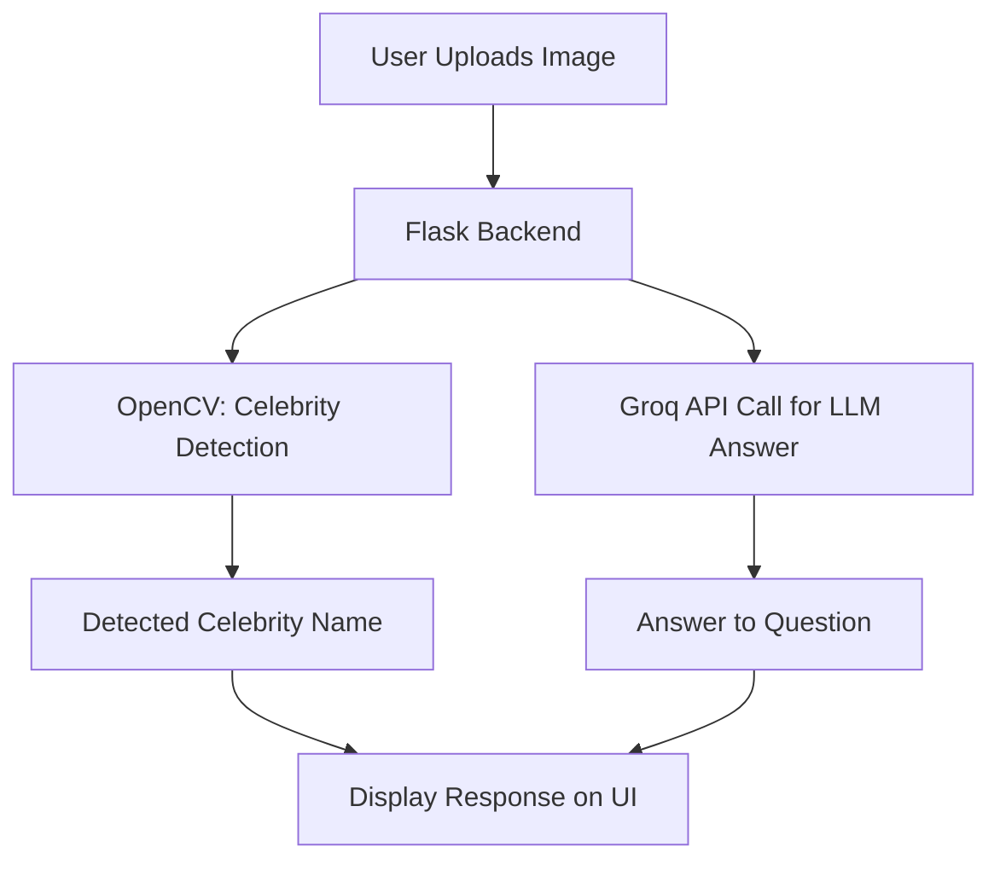
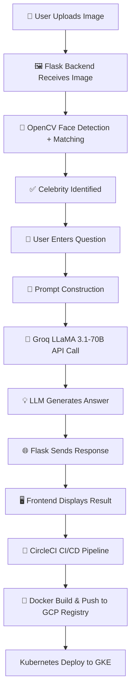

<p align="center">
  
  
</p>

<h1 align="center">🎬 CelebMind: Celebrity Detector & Q&A App</h1>

<p align="center">
  An intelligent AI app that <strong>detects celebrities from uploaded images</strong> and answers user queries about them using <strong>Groq's Llama 3 LLM</strong>. Built with <strong>OpenCV</strong>, <strong>Flask</strong>, and <strong>Kubernetes</strong> for scalable deployment.
</p>

---

## 📌 Features

- 🧠 **LLM-Powered Q&A**: Asks questions about the detected celebrity using Groq's Llama 3 model.
- 🧍‍♂️ **Celebrity Detection**: Uses OpenCV to detect and identify celebrities from uploaded photos.
- 🚀 **Real-time Inference**: Instant answers from LLM served via Flask API.
- 📦 **Dockerized Microservice**: Containerized and deployable across any environment.
- ☸️ **Kubernetes Ready**: GKE deployment with CircleCI for CI/CD.
- 🔒 **Secure & Lightweight**: Environment variable support with `.env` and optimized image.

---

## 🧱 Architecture



## 🔄 Project Workflow

## 🔄 Step-By-Step : How it works?

The **CelebMind** project follows a streamlined workflow to deliver fast, intelligent celebrity detection and Q&A using LLMs:

---

### 1. 🖼️ User Uploads an Image
- The user provides an image via the frontend interface.
- The image is sent to the Flask backend API.

---

### 2. 🧠 Celebrity Detection (OpenCV)
- The backend uses **OpenCV** to analyze facial features.
- It matches the image with a pre-defined celebrity dataset (embeddings or templates).
- If a match is found, the **celebrity's name is extracted**.

---

### 3. ❓ User Submits a Question
- The user types a **natural-language question** related to the celebrity.
- The question and the detected celebrity name are **combined into a single prompt**.

---

### 4. ⚡ Groq LLM API (LLaMA 3.1 70B)
- The composed prompt is sent to **Groq's ultra-fast inference API** using the `llama3-70b-qa` model.
- The model generates an **intelligent and context-aware answer**.

---

### 5. 🛠️ Flask Response Rendering
- The LLM response is sent back to the Flask server.
- Flask renders the result along with:
  - The detected image
  - The celebrity name

---

### 6. 💻 Frontend Display
The UI displays:
- ✅ Detected celebrity photo and name  
- ✅ User's original question  
- ✅ LLM-generated answer  

---

### 7. 🚀 CI/CD & Deployment
- Code is pushed to **GitHub**
- **CircleCI pipeline**:
  - Builds Docker image
  - Pushes image to **GCP Artifact Registry**
  - Deploys to **Google Kubernetes Engine (GKE)** using `kubectl`

---

## 🧪 Tech Stack
| Area       | Tools & Frameworks               |
| ---------- | -------------------------------- |
| Backend    | Flask, Python                    |
| Frontend   | HTML/CSS, JS (simple templating) |
| ML / AI    | OpenCV, Groq API (LLaMA-3.1 70B) |
| Deployment | Docker, Kubernetes (GKE)         |
| CI/CD      | CircleCI, GitHub                 |
| Infra      | GCP VM, GKE, Container Registry  |

---
## 🚀 Setup Instructions
### 1️⃣ Clone the repo
```bash
git clone https://github.com/aimldinesh/celebmind.git
cd celebmind
```
### 2️⃣ Create and Activate Virtual Environment
```bash
python -m venv venv
source venv/bin/activate  # On Windows: venv\Scripts\activate
```
### 3️⃣ Install dependencies
```bash
pip install -e .
```
### 4️⃣ Set environment variables
Create a .env file:
```bash
GROQ_API_KEY = ""
```
### 5. Run locally
```bash
python app.py
```
The app will be available at: http://127.0.0.1:5000

---
## ✅ Docker Run (Optional)
```bash
docker build -t celebmind-app .
docker run -p 5000:5000 celebmind-app
```
## 📸 Sample Output

---
## 📚 Future Improvements

- ✅ **Add multiple celebrity support**  
- ✅ **Enhance UI styling**  
- 🔜 **Add Redis caching for Q&A**  
- 🔜 **Integrate voice-based question input**

---
## 💡 Credits
- Groq API (LLaMA 3)
- OpenCV for computer vision
- Flask for backend
- Kubernetes on GKE

---
## 🤝 Contributors
- [Dinesh](https://github.com/aimldinesh)

